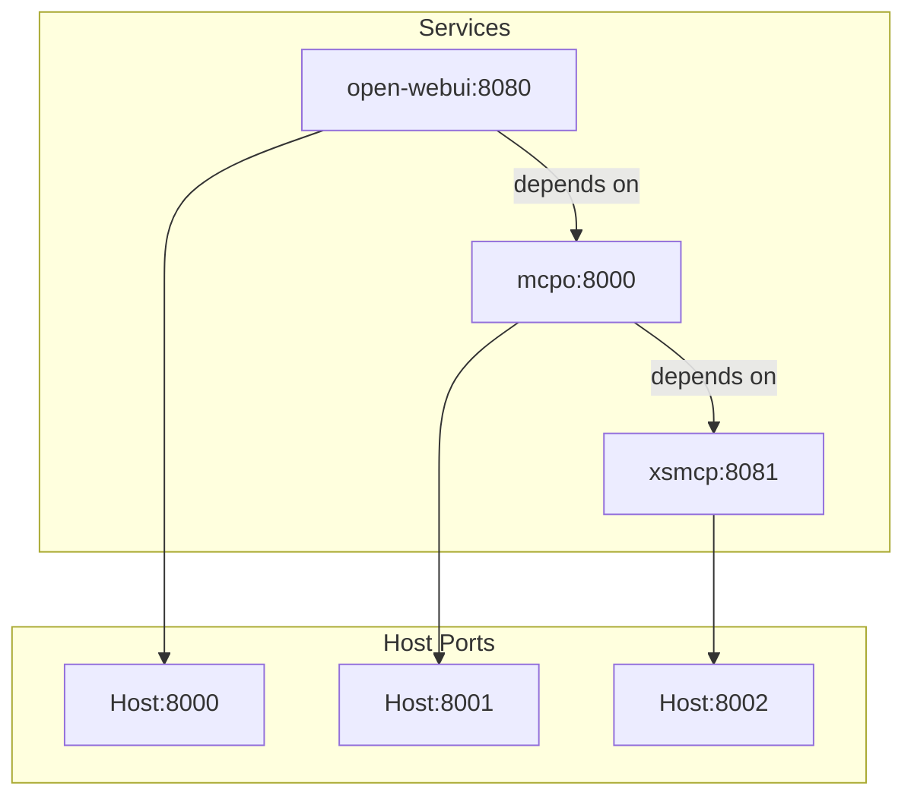
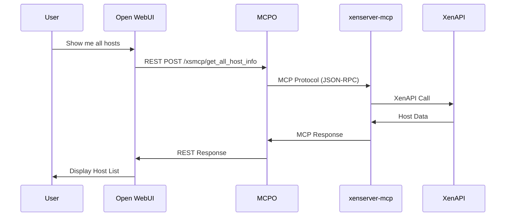

# XenServer MCP Server

A Model Context Protocol server for XenServer/XCP-ng hypervisors using XenAPI, served through MCPO for AI assistant integration.


## How Components Connect

**Data Flow Example**: 
```
  User asks "show me all hosts" in the chat box 
  → Open WebUI calls REST endpoint `/xsmcp/get_all_host_info` 
  → MCPO translates to MCP protocol 
  → xenserver-mcp calls XenAPI 
  → Returns host data
```


## Quick Start

1. **Configure credentials:**
   
   `xenserver-mcp/.env`:
   ```env
   XENSERVER_HOST=your-xenserver-host.example.com
   XENSERVER_USER=root
   XENSERVER_PASS=your-xenserver-password
   ```

2. **Start services:**
   ```bash
   docker-compose up -d
   ```

After starting the services, access them at:
- **[Open WebUI](https://github.com/open-webui/open-webui)**: http://localhost:8000  
- **[MCPO](https://github.com/open-webui/mcpo)**: http://localhost:8001/docs
- **XenServer MCP Server**: http://localhost:8002


## How to Use MCP on Open WebUI

1. Open Open WebUI in your browser at http://localhost:8001
2. Navigate to **Settings** > **External Tools** > **Add Tool Server**
3. Enter the MCP server URL: `http://localhost:8001/xsmcp`
4. Save the configuration
5. Open a **New Chat**
6. Click the **integrations** button (plus sign icon)
7. Enable **XenServerMCP** in the Tools list


## How to Add a New Tool

1. **Write a Python function** in `xenserver-mcp/main.py`:
```python
@xenserver_mcp.tool()
def restart_vm(vm_uuid: str) -> Dict[str, Any]:
    """Restart a virtual machine by UUID."""  # ← AI sees this description
    with xenserver_client.session() as session:  # ← Always use context manager
        vm_ref = session.xenapi.VM.get_by_uuid(vm_uuid)
        session.xenapi.VM.clean_reboot(vm_ref)
        return {"status": "restarting", "vm_uuid": vm_uuid}
```

2. **Rebuild** the service: `docker compose up --build --force-recreate --no-deps -d xsmcp`

3. **Test it:** 
```bash
# Check logs
docker compose logs -f xsmcp

# Test MCP protocol connectivity (direct to XenServer MCP service)
curl -X POST http://localhost:8002/ \
  -H "Content-Type: application/json" \
  -H "Accept: application/json, text/event-stream" \
  -d '{"jsonrpc":"2.0","id":1,"method":"initialize","params":{"protocolVersion":"2024-11-05","capabilities":{"tools":{}},"clientInfo":{"name":"test","version":"1.0.0"}}}'

# Test get_all_host_info tool via MCPO
curl -X 'POST' \
  'http://localhost:8001/xsmcp/get_all_host_info' \
  -H 'accept: application/json' \
  -H 'Content-Type: application/json' \
  -d '{}'

# Run cmd in the open-webui container
curl -X 'POST'   'http://mcpo:8000/xsmcp/get_all_host_info'   -H 'accept: application/json'   -H 'Content-Type: application/json'   -d '{}'
```